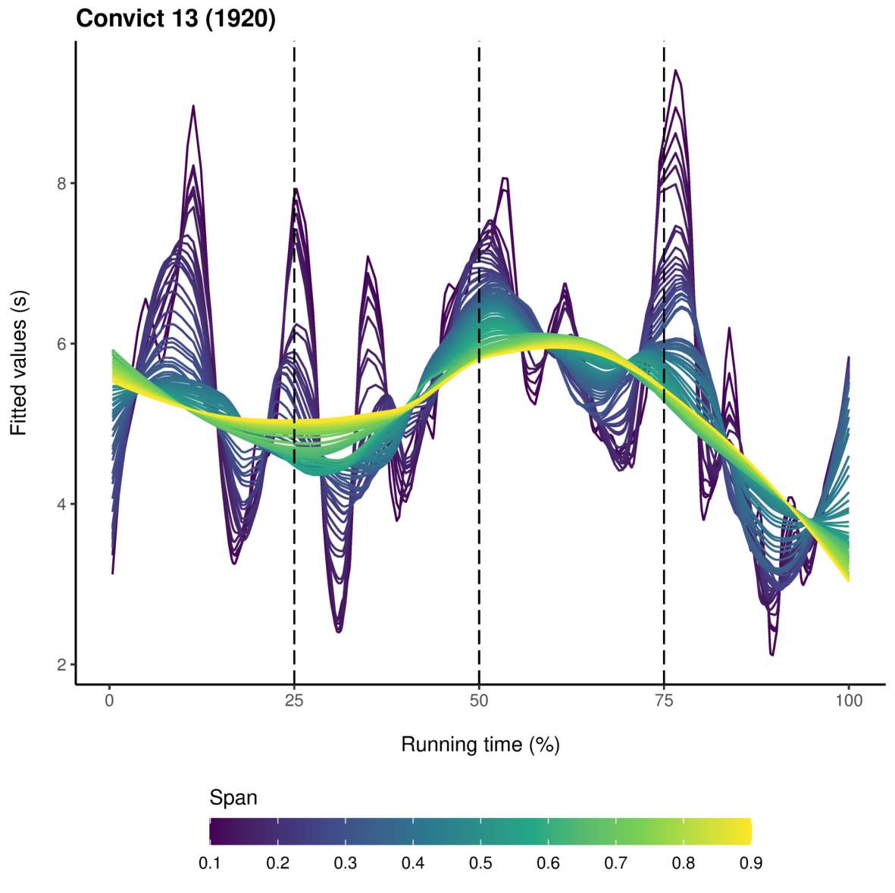

# loessggplot

The ```loessggplot``` function fits a set of LOESS smoothers to the shot length data of a motion picture, iterating over a range of spans specified by the user and plotting the result using ```ggplot2```, in order to identify the temporal structure of a film's editing without committing the analyst to a particular level of smoothing before applying the function. 

LOESS, or locally estimated scatterplot smoothing, is a nonparametric method for fitting a curve to an independent variable. Rather than fitting a global model, LOESS fits a linear or quadratic function, depending on the degree of the polynomial used, to a localised section of the data. The size of the segment of the data is determined by the span of the local window, with more data used in fitting the curve as the span increases. 

```loessggplot``` allows the analyst to identify the editing structure of a film at different scales by using different spans. At the macro-scale, LOESS smoothers with large spans describe the dominant trend in the editing of a film; while at the micro-scale smoothers with small spans reveal transient features associated with the editing of specific moments in a film.

```loessggplot``` takes the following arguments:

- ```x```: a numeric vector of the lengths of shots in a film in temporal order.
- ```low```, ```high```, ```step```: ```low``` and ```high``` set the limits on the range of the spans of the LOESS smoothers, and ```step``` defines the increase in the value of the span for each iteration.
- ```title```: text added between "" is added to the plot as a title.
- ```ticks```: specifies the distance between tick marks on the colour bar in the legend. The lower and upper limits of the colour bar are set by ```low``` and ```high```, respectively.

To draw the plot using the shot length data for the Buster Keaton film *Convict 13* (1920) using data from the [Buster Keaton dataset](https://computationalfilmanalysis.wordpress.com/2020/07/07/keaton-data-set/), we use the command:

```R
loessggplot(convict_13, low = 0.1, high = 0.9, step = 0.01, title = "Convict 13 (1920)", ticks = 0.1)
```
which returns the following plot:



The above plot can be used diagnostically for exploratory data analysis in order to decide which spans for the LOESS smoother are the most informative or for limiting the range of spans used for cross-validation to speed up the process of selecting the best span to describe the data.
